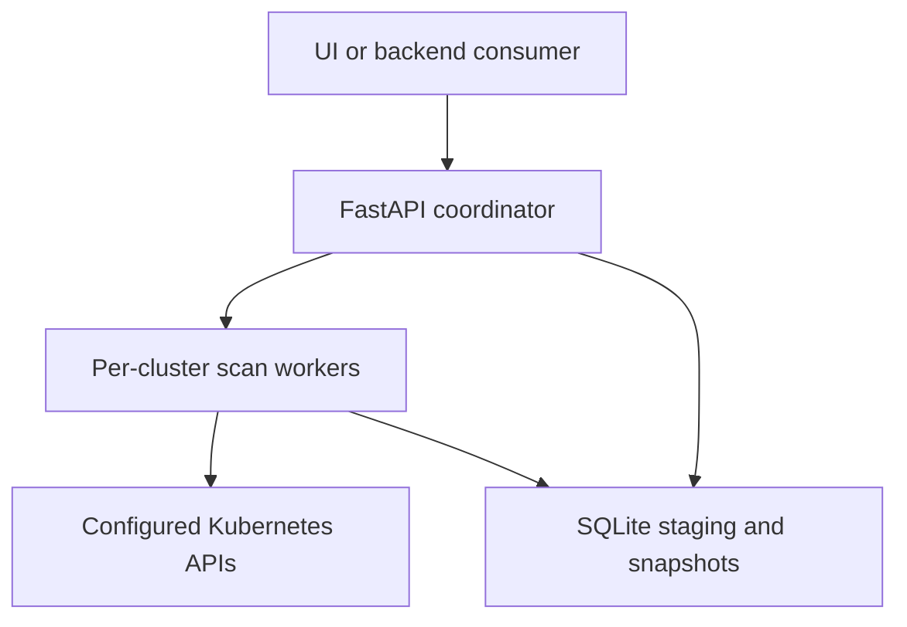
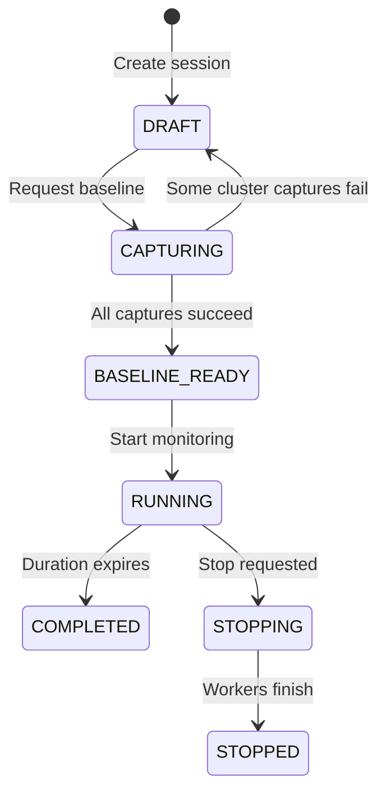

# Central Patch Monitor 0.7.2: implementation and integration reference

Version: central application 0.7.2. Documentation baseline: clean source commit `c2f557f`.
Audience: engineers, API consumers, and AI coding models continuing this project.
Language: English; UI labels and some validation messages are Turkish.

This document describes implemented behavior in the referenced source. Proposed features are explicitly identified as unimplemented. It does not certify any live deployment, remote API connectivity, container registry publication, or production performance. All environment names and domains below are illustrative.

## Contents

1. [Scope and architecture](#1-scope-and-architecture)
2. [Source map and reading order](#2-source-map-and-reading-order)
3. [Vocabulary and invariants](#3-vocabulary-and-invariants)
4. [Configuration and validation](#4-configuration-and-validation)
5. [Session lifecycle](#5-session-lifecycle)
6. [Collection and scheduling](#6-collection-and-scheduling)
7. [Image, health, and rollout semantics](#7-image-health-and-rollout-semantics)
8. [SQLite model and transactions](#8-sqlite-model-and-transactions)
9. [Comparison algorithm](#9-comparison-algorithm)
10. [HTTP API contract](#10-http-api-contract)
11. [Consumer example](#11-consumer-example)
12. [SSE and consistency](#12-sse-and-consistency)
13. [UI behavior](#13-ui-behavior)
14. [Deployment and trust](#14-deployment-and-trust)
15. [Logging and troubleshooting](#15-logging-and-troubleshooting)
16. [Capacity and retention](#16-capacity-and-retention)
17. [Restart, backup, and upgrade](#17-restart-backup-and-upgrade)
18. [Verification](#18-verification)
19. [Known limitations and development priorities](#19-known-limitations-and-development-priorities)
20. [Handoff rules for the next model](#20-handoff-rules-for-the-next-model)

## 1. Scope and architecture

The central application is a read-only Kubernetes/OpenShift image and container-health observer. One central pod connects to one or more configured API servers. Remote clusters require credentials and RBAC, but no remote application agent. The application never changes workload images, applies patches, restarts pods, executes remote shell commands, or calls an LLM in central mode.

The runtime comprises FastAPI/Uvicorn, an asyncio coordinator, blocking HTTP collectors executed through `asyncio.to_thread`, one SQLite database, and a bundled HTML/JavaScript UI. The UI consumes the same REST endpoints available to another backend. A Route can expose the Service; the API is not restricted to calls originating from the UI.



The central entrypoint is `app.central:create_app`, invoked with `--factory --workers 1`. The supplied central deployment has one replica and `Recreate` strategy. The single-process constraint is architectural: locks, scan tasks, cancellation state, and SSE client accounting are process-local. Increasing workers/replicas does not provide supported high availability.

The repository also contains an older distributed master/agent implementation. Do not infer central features from those files. The shared requirements file includes packages used by the older mode; central collection itself uses `requests`, not the Kubernetes Python client.

## 2. Source map and reading order

| Source | Responsibility |
|---|---|
| `app/central.py` | App factory, routes, request models, session orchestration, periodic maintenance, SSE |
| `app/central_config.py` | Strict YAML configuration models and defaults |
| `app/namespace_patterns.py` | Shared comma-separated glob grammar and matching |
| `app/central_collect.py` | Paginated API GETs, normalization, image/health/rollout rules, synthetic demo rows |
| `app/central_store.py` | SQLite schema, atomic publication, SQL filters/comparison, retention |
| `app/central_logging.py` | JSON stdout logging and field allowlist |
| `app/central_ui.html`, `app/central_ui.js` | Guided flow form, live tables, comparison, history, detail dialog |
| `config/central.example.yaml` | Generic real-cluster configuration |
| `config/central.demo.yaml` | Synthetic local demo configuration |
| `Dockerfile.central` | Central image build and runtime command |
| `deploy/central/` | Central RBAC, ConfigMap, PVC, Deployment, Service, Route |
| `docs/central-openapi.json` | Exported central HTTP schema; runtime `/openapi.json` is authoritative |
| `docs/central-config.schema.json` | Configuration schema generated from `Config` for this documentation release |
| `tests/test_central.py` | Lifecycle, collection, failure, image, and storage tests |
| `tests/test_ui_revision.py` | Scope, designs, comparison, and retention tests |
| `tests/test_central_logging.py` | Operational logging tests |
| `scripts/smoke_central.py` | Isolated real HTTP and SSE demo test |
| `scripts/test_ui_dom.cjs` | DOM interaction against a real demo HTTP server |

Legacy entrypoints include `app.main` and `app.master`; legacy deployment files are directly under `deploy/`. The root `openapi.json` and `docs/MASTER_CONTRACT.md` concern the older system. For central integrations, use `docs/central-openapi.json`.

Recommended reading order: this document → `central_config.py` → `central.py` → `central_collect.py` → `central_store.py` → tests → UI. Source and tests take precedence over earlier prose when describing 0.7.2.

## 3. Vocabulary and invariants

- **Flow template**: an entry under YAML `flows`; defines allowed polling and resource limits.
- **Saved design**: a named request-body recipe stored in SQLite. It is not a running task.
- **Session**: a concrete monitoring run with target tag, selected clusters, duration, and frozen configuration.
- **Baseline**: first successful full collection for a session/cluster. Immutable after publication.
- **Current**: latest successfully published collection for a session/cluster.
- **Stage**: partially collected rows not visible through the normal inventory API.
- **Pod row**: one regular container in one observed pod, not one Deployment and not one namespace.
- **Desired row**: synthetic record indicating that a workload requests a target image but no matching pod container was observed.
- **Revision**: session-wide change notification counter, not a Kubernetes `resourceVersion`, timestamp, or immutable snapshot identifier.
- **Freshness**: age/error assessment of published cluster data. It is separate from container health.

Required invariants for future changes:

1. Only one session may actively reserve/collect the monitoring slot.
2. Partial or failed scans must not replace last-good current data.
3. Successful baselines must not be overwritten during retries.
4. Cluster failure must not block other cluster workers indefinitely.
5. SQL filters and collector scope must agree on namespace glob semantics.
6. `Running` phase must not be interpreted as container readiness.
7. Unknown image tags must not silently become target matches.
8. Credentials and raw API response bodies must not be emitted in operational logs.
9. Institution-specific identifiers belong in deployment-time configuration, not committed examples.
10. Proposed workflow engines, authentication, event timelines, and LLM integrations must not be described as implemented.

## 4. Configuration and validation

The factory reads an explicitly supplied path or `PATCH_CONFIG_FILE`, default `/etc/patch/config/central.yaml`. It parses YAML using `safe_load` and validates `Config`. Invalid startup configuration prevents initialization. Configuration objects inherit `extra='forbid'`; unknown YAML keys fail validation.

Configuration revision is the first 16 hexadecimal characters of SHA-256 of the raw YAML bytes. Even formatting-only changes can change this revision. It is unrelated to the application version and session revision.

### 4.1 Cluster settings

| Field | Default / rule |
|---|---|
| `id` | Required, 1–64 ASCII letters/digits/underscore/hyphen; unique among clusters |
| `connection` | `inCluster`; allowed `inCluster` or `remote` |
| `api_url` | `https://kubernetes.default.svc:443` |
| `token_file` | `/var/run/secrets/kubernetes.io/serviceaccount/token` |
| `ca_file` | `/var/run/secrets/kubernetes.io/serviceaccount/ca.crt` |
| `namespace_pattern` | Regex `^(test-|uat-)`, evaluated with `re.search` |
| `allow_http` | `false`; HTTP needs explicit opt-in |

URLs must have a hostname, no embedded username/password, query, fragment, or non-root path. Remote entries must override both default credential paths. The connection label does not discover an endpoint or import a kubeconfig; explicit fields drive requests.

Use HTTPS for the local Kubernetes Service. Its Service port is normally 443 even when the API server listens behind it on 6443. HTTP is supported only for a deliberately provisioned trusted API proxy with `allow_http: true`; there is no automatic downgrade or `verify=false` fallback.

### 4.2 Flow settings

| Field | Default | Validation |
|---|---:|---|
| `interval_seconds` | 5 | 1–3600 |
| `request_timeout_seconds` | 10 | 1–120 |
| `scan_timeout_seconds` | 120 | 5–1800 |
| `page_size` | 200 | 1–1000 |
| `max_page_bytes` | 4194304 | 1024–16777216 |
| `max_objects` | 20000 | 10–200000 |
| `max_rows` | 30000 | 10–500000 |
| `session_max_minutes` | 120 | 1–720 |
| `failure_backoff_max_seconds` | 60 | 1–3600 |
| `stale_after_seconds` | 20 | At least 1 |
| `resources` | deployments, statefulsets, daemonsets | Nonempty list using only these names |

At least one named flow must exist. A request can choose a slower interval, but cannot go below the chosen template's configured interval. Supplying an interval also raises the session's stale threshold to at least three times that interval. Omitting an interval retains the template threshold; administrators should keep a sensible interval/threshold relationship.

### 4.3 Images and namespace scope

`images.registry_prefixes` defaults to an empty list, meaning include all regular container images. Nonempty values use literal `image.startswith(prefix)` checks, not parsed registry identity or glob matching.

`images.tag_match_mode` defaults to `exact`. `release` uses `release_pattern`, default `^(\d+\.\d+\.\d+)(?:-.+)?$`. The expression must compile and contain exactly one capturing group.

Session `namespace_glob` accepts up to 20 comma-separated patterns, total input at most 1024 characters, each at most 253. Whitespace around patterns is stripped and duplicate patterns are removed. Allowed characters: lowercase letters, digits, `*`, `?`, `.`, `_`, `-`. Empty components, bracket expressions, and regex syntax are rejected.

Example: `test-*, uat-*,test-*` normalizes to `test-*,uat-*`. Patterns use OR semantics. The effective collection selection is:

```text
cluster.namespace_pattern regex matches
AND any session namespace_glob pattern matches
AND (session namespaces list is empty OR exact namespace is listed)
```

An exact namespace list does not bypass the glob. Glob selection does not bypass the cluster regex or RBAC. View filters only narrow stored data; they never initiate collection.

Implementation nuance: `Monitor.design()` assigns request `namespace_glob` and `namespaces` into the copied configuration, including request defaults. Therefore top-level YAML `scope` is not an immutable administrator boundary for API-created sessions. Use each cluster's `namespace_pattern` and actual Kubernetes RBAC for that boundary. The preview response's scope note refers to the cluster restriction; it does not promise an intersection with every YAML scope field.

### 4.4 Storage and process settings

| Setting | Default | Validation / meaning |
|---|---|---|
| `storage.database_path` | `/data/patch.db` | SQLite file path |
| `storage.retention_days` | 14 | 1–365; closed-session retention |
| `storage.max_database_mb` | 512 | 8–10240; SQLite page-count cap |
| `config_reload_seconds` | 15 | 1–300 |
| `stream_seconds` | 2 | 1–30 |
| `max_stream_clients` | 30 | 1–500; process-wide SSE connection count |
| `demo` | false | Synthetic rows; no real API collection |
| `clusters` | Required | 1–20 entries |

Environment variables:

- `PATCH_CONFIG_FILE`: config path, read when creating the app.
- `PATCH_LOG_LEVEL`: `DEBUG`, `INFO`, `WARNING`, or `ERROR`; default `INFO`.
- `PATCH_LOG_STATE_INTERVAL_SECONDS`: integer 5–3600, default 60.

Logging environment settings require process restart. Periodic YAML reload replaces valid global configuration for future sessions. Active sessions retain their stored configuration. Retention changes are accepted live and affect cleanup globally. Database path, database cap, and demo-mode changes require restart; a reload containing these changes is rejected as a whole. If parsing fails, the prior valid configuration remains in use. Cleanup in that same maintenance iteration is skipped when loading raises an exception.

SSE interval/client limits use current global configuration, not the frozen session configuration. Mounted token and trust-file contents can rotate even though their paths in an active session remain frozen.

## 5. Session lifecycle



This diagram shows the common path, not every permitted transition. Drafts and baseline-ready sessions can also be stopped. On process startup, persisted `RUNNING`, `CAPTURING`, and `STOPPING` sessions become `INTERRUPTED`; leftover stage rows are removed. No collection automatically resumes.

`POST /sessions` creates a UUID hex ID and `DRAFT`. It does not call any Kubernetes API. Reservation states are `DRAFT`, `CAPTURING`, `BASELINE_READY`, `RUNNING`, and `STOPPING`; any one prevents another session from being created. Collectors still finishing also block new work.

`POST /sessions/{id}/baseline` returns 202 after scheduling work. Capture runs once per selected cluster concurrently. A complete successful cluster baseline is retained if another cluster fails. The aggregate status becomes `BASELINE_READY` only when all selected clusters have baseline flags. Otherwise it returns to `DRAFT`; inspect per-cluster errors and explicitly retry baseline. Successful clusters are skipped on retry. There is no automatic baseline retry loop.

`POST /sessions/{id}/start` accepts `BASELINE_READY`, or `INTERRUPTED` with all baselines complete. It records `ends = now + duration`, starts one worker per selected cluster, and starts expiry tracking. The first live scan begins immediately. Duration begins at start, not at creation or baseline capture. Starting an interrupted session grants the full configured duration again.

`POST /sessions/{id}/stop` requests cancellation and waits for tasks before setting `STOPPED`. It is not an immediate forced thread kill. In-flight blocking HTTP requests must reach timeout or cancellation checks. Already stopped/completed sessions return their state without restarting anything.

Expiry sets `COMPLETED` and cancellation. A collector finishing late cannot publish because publication checks session state. A later create may briefly return 409 while background tasks unwind. Terminal snapshots remain queryable until retention deletes them.

There is no baseline overwrite endpoint, session deletion endpoint, automatic draft timeout, durable job queue, or schedule-by-calendar API.

## 6. Collection and scheduling

For each scan, the collector creates a new `requests.Session` with `trust_env=False`: proxy and ambient credential settings are not automatically inherited. Requests use configured origin + fixed resource paths, a Bearer token loaded from a file, configured CA verification for HTTPS, and `allow_redirects=False`.

Collection order:

1. Paginate `GET /api/v1/namespaces` and select namespace names.
2. Within each selected namespace, paginate chosen workloads under `/apis/apps/v1/namespaces/{namespace}/{resource}`.
3. When deployments are enabled, paginate ReplicaSets and map their controller owner references to Deployments.
4. Paginate `GET /api/v1/namespaces/{namespace}/pods`.
5. Normalize regular `spec.containers` using `status.containerStatuses` and owner maps.
6. Emit missing-target synthetic desired records.
7. Publish only after the entire cluster scan completes successfully.

Jobs, CronJobs, DeploymentConfigs, init containers, and ephemeral containers are not fully modeled resources. Pods with unknown owners can still appear using fallback owner information, but desired-image/rollout resolution may be unavailable. Events and pod logs are not collected in central mode.

Every API list request uses `limit=page_size`; continuation requests also send the opaque `continue` token. Repeated continuation tokens are rejected. An HTTP 410 is treated as a failed scan; the next scheduled scan begins again rather than resuming the expired list. No watch or Kubernetes event stream is used.

Response bodies are read in 65536-byte chunks into a bounded buffer, then decoded as JSON. A response must be an object with an `items` list. `max_objects` counts all yielded objects across list operations in one scan, including namespaces and workload objects. `max_rows` limits normalized emitted rows. Full JSON pages and compact namespace/owner/desired maps still occupy memory; bounds are not a demonstrated total RSS budget.

Token content is reread for every page. The CA path is supplied for every HTTPS request; pooled TLS connections may reuse prior handshakes within a scan. A fresh session/pool on the next scan gives replaced trust files a new connection boundary. Do not promise instantaneous CA rotation for an already established connection.

Connect and read timeouts each use `request_timeout_seconds`. The scan deadline uses monotonic time and is checked between operations and response chunks. It is cooperative, not a hard interrupt of a blocking socket call.

After a successful scan, the worker aims for a start-to-start interval:

```text
sleep = max(0.1, interval_seconds - scan_elapsed_seconds)
```

After failure:

```text
failures = min(previous_failures + 1, 10)
base_delay = min(failure_backoff_max_seconds, interval_seconds * 2**failures)
sleep = max(0.1, base_delay - scan_elapsed_seconds)
```

Failures reset to zero on success. A five-second interval does not guarantee a fresh complete scan every five seconds if collection takes longer. Scans for a given worker do not overlap; cluster workers are independent. Database transactions are serialized through a shared lock.

## 7. Image, health, and rollout semantics

### 7.1 Image matching

`image_parts()` separates digest at `@` and treats a colon as a tag delimiter only in the final path segment. Thus a registry port does not become a tag. Digest-only or untagged references have `image_tag=null` and cannot match a target. A tag plus digest can still match by tag. Runtime `imageID` is recorded separately and is not used to prove registry digest equality.

| Image / target | Mode | Result |
|---|---|---|
| `registry.example.com/app:1.4.1` / `1.4.1` | exact | Match |
| `registry.example.com/app:1.4.1-build7` / `1.4.1` | exact | No match |
| `registry.example.com/app:1.4.1-build7` / `1.4.1` | release | Match with default regex |
| `registry.example.com:5000/app@sha256:abcd` / `1.4.1` | either | No tag, no match |
| `registry.example.com/app:2.0.0` / `1.4.1` | either | No match; not necessarily an older version |

Only the observed image tag is normalized in release mode. Consumers should supply a base target such as `1.4.1` when using the default release family rule. Nonmatching custom tags fall back to literal comparison. This is not general semantic-version ordering.

### 7.2 Container health precedence

The first matching rule wins:

| Condition | `health` |
|---|---|
| Pod has deletion timestamp | `TERMINATING` |
| Waiting/terminated reason is CrashLoopBackOff | `CRASH` |
| Reason ImagePullBackOff or ErrImagePull | `IMAGE_PULL_ERROR` |
| Current termination exit code nonzero | `CRASH` |
| Container ready and current state contains running | `READY` |
| Current termination exit code zero | `COMPLETED` |
| CreateContainerConfigError, CreateContainerError, RunContainerError | `ERROR` |
| Pod phase Failed | `ERROR` |
| Otherwise | `NOT_READY` |

`BAD = {CRASH, IMAGE_PULL_ERROR, ERROR}` for comparison error counts. `NOT_READY`, `TERMINATING`, and `COMPLETED` are not included in those counts. Pod phase is stored independently. Previous termination reason is evidence only: a previous OOM does not override a currently ready container.

### 7.3 Rollout approximation

For supported workloads, `COMPLETE` requires observed generation at least metadata generation, updated replicas equal wanted replicas, and ready replicas equal wanted replicas. DaemonSets use desiredNumberScheduled, updatedNumberScheduled, and numberReady. A Progressing condition with status False overrides to `FAILED`; otherwise incomplete status is `PROGRESSING`.

This is a simplified shared rule, not the exact controller-specific `kubectl rollout status` implementation. It does not fully evaluate StatefulSet partitions/revisions, all rollout strategies, or terminating old replicas. Keep actual observed images and health visible even if rollout says complete.

For each workload/container requesting a target image without any observed target-image pod container, emit one `row_type=desired` row with `WAITING_FOR_POD`. This is a presence check, not a desired replica deficit count. A zero-replica workload can produce a placeholder. Once one matching pod container appears, the placeholder disappears even if more replicas are expected.

## 8. SQLite model and transactions

Default file: `/data/patch.db`. No separate database server is required. SQLite uses `journal_mode=DELETE`, `foreign_keys=ON`, a nominal 4 MiB page cache (`cache_size=-4096`), `check_same_thread=False`, and a Python `RLock` around operations. JSON is encoded as TEXT using `json.dumps`, not a separate document store or JSONB column.

### 8.1 Tables

```sql
CREATE TABLE designs (
  name TEXT PRIMARY KEY,
  description TEXT,
  body TEXT
);
CREATE TABLE sessions (
  id TEXT PRIMARY KEY,
  status TEXT,
  target TEXT,
  flow TEXT,
  config TEXT,
  created REAL,
  ends REAL,
  duration INTEGER,
  revision INTEGER DEFAULT 0,
  closed_at REAL
);
CREATE TABLE clusters (
  session TEXT REFERENCES sessions(id) ON DELETE CASCADE,
  cluster TEXT,
  baseline INTEGER DEFAULT 0,
  observed REAL,
  error TEXT,
  PRIMARY KEY(session, cluster)
);
CREATE TABLE rows (
  session TEXT REFERENCES sessions(id) ON DELETE CASCADE,
  cluster TEXT,
  layer TEXT,
  id TEXT,
  namespace TEXT,
  workload_uid TEXT,
  container TEXT,
  image TEXT,
  target_match INTEGER,
  health TEXT,
  row_type TEXT,
  payload TEXT,
  PRIMARY KEY(session, cluster, layer, id)
);
CREATE INDEX row_filter ON rows(session, layer, target_match, health);
CREATE INDEX row_group ON rows(session, layer, cluster, namespace, workload_uid, container);
```

This is the effective 0.7.2 schema. Actual initialization creates the older sessions definition then adds `closed_at` if absent. There is no external migration framework or schema-version table.

Timestamps are Unix seconds as REAL. `duration` is integer seconds; request duration is minutes. Booleans in SQL columns are 0/1. JSON payloads use JSON booleans/nulls. `designs.body` holds the saved request settings. `sessions.config` holds the complete frozen configuration; credentials are file references, not token contents. Internal endpoints and paths remain deployment metadata in this database and should not be published as sample data.

Row IDs for real pods are the first 32 hex characters of SHA-256 of `cluster_id/pod_uid/container_name`. Desired IDs hash `cluster_id/workload_uid/container_name/desired`. Comparison identity uses workload UID rather than row ID so rollout pod replacements can be compared.

### 8.2 Normalized row payload

All of these fields are stored in `payload`:

| Field(s) | Meaning |
|---|---|
| `id`, `cluster`, `namespace` | Record identity and location |
| `workload`, `workload_kind`, `workload_uid` | Resolved or fallback controller |
| `container` | Regular container name |
| `image`, `image_tag` | Pod spec image and extracted tag |
| `desired_image` | Resolved workload template image; empty if unavailable |
| `runtime_image_id` | Container status imageID; empty if unavailable |
| `target_match` | Match against frozen target policy |
| `row_type` | `pod` or `desired` |
| `pod`, `pod_uid` | Empty for synthetic desired rows |
| `phase`, `health`, `ready`, `reason` | Observed phase and normalized current health |
| `restart_count`, `previous_termination` | Restart count and prior termination reason |
| `rollout` | Simplified workload rollout assessment |

Filter columns duplicate selected payload fields deliberately for SQL queries. Mutations must keep duplicated values consistent. Direct SQL writes by external consumers are unsupported; use the API.

### 8.3 Publication algorithm

At scan start remove any old stage rows for the session/cluster. Insert normalized batches of at most `min(page_size, 200)` into layer `stage`, committing batches. These records are invisible to current queries.

After successful collection, one transaction validates that the session is CAPTURING/RUNNING and that a requested baseline has not already been published. It deletes the prior current layer, renames stage rows to current, optionally copies current to baseline, sets cluster baseline/observed/error fields, and increments session revision.

A successful zero-row collection is still a valid snapshot: current becomes empty and observed advances. A failed collection removes stage rows, records a sanitized cluster error, and increments revision without changing current or baseline. If even error recording fails, the monitor latches a storage error, requests cancellation, and readiness fails.

Atomicity is per cluster. Separate resource lists and clusters are observed at different times. Publication guarantees a complete application scan, not a transactionally consistent Kubernetes-wide instant.

## 9. Comparison algorithm

Comparison is computed on demand in SQL; no comparison-results table exists. Only `row_type=pod` baseline/current records participate. The stable group key is `(cluster, namespace, workload_uid, container)`.

For each layer/group, compute distinct image strings, total rows, ready rows, error rows, known-tag rows, and target-matching rows. The returned `before_images` and `after_images` are comma-separated strings, not JSON arrays. Other fields include `before_total`, `after_total`, `before_ready`, `after_ready`, `before_errors`, `after_errors`, `target_replicas`, both classification axes, and the legacy classification. An absent side produces null aggregate fields.

### 9.1 Version axis: `version_status`

Rules in precedence order:

1. No current group → `REMOVED`.
2. No known tags → `UNKNOWN_VERSION`.
3. Some tags unknown → `PARTLY_UNKNOWN`.
4. All rows match target → `TARGET_REACHED`.
5. Some rows match target → `MIXED_VERSION`.
6. Otherwise → `NOT_UPDATED`.

`NOT_UPDATED` means no observed known-tag row matches the target. It does not establish whether another tag is semantically older or newer. `PARTLY_UNKNOWN` takes precedence over mixed-version reporting.

### 9.2 Health axis: `health_change`

Rules in precedence order:

1. No current group → `REMOVED`.
2. No baseline group and current errors > 0 → `NEW_WITH_ERRORS`.
3. No baseline group → `NEW_RESOURCE`.
4. Current errors > baseline errors → `REGRESSION`.
5. Baseline errors > 0, current errors = 0, all current rows ready → `RECOVERED`.
6. Current errors > 0 but fewer than baseline → `IMPROVING`.
7. Current errors > 0 → `PERSISTING_ERROR`.
8. All current rows ready → `HEALTHY`.
9. Otherwise → `NOT_READY`.

These measure aggregate counts, not causal attribution. Equal error counts can involve different pods or causes. Replica scaling can change counts without changing per-replica failure rates. A current all-ready group that was merely not-ready, with no baseline BAD errors, is HEALTHY rather than RECOVERED. Recreating a workload changes its UID and can appear as removed + new.

### 9.3 Legacy axis

`classification` remains for compatibility. Its precedence is NEW_RESOURCE → REMOVED → REGRESSION → RECOVERED → PERSISTING_ERROR → UNKNOWN_VERSION → MIXED_VERSION → OLD_VERSION → IMAGE_CHANGED → UNCHANGED, using the corresponding conditions in `Store.changes()`. It mixes health/version concepts and must not be the only field used by new UIs. Summary `change_counts` refers to this legacy axis; `health_counts` refers to the new health axis.

Version and health query filters combine with AND. Search first selects group keys that match in either baseline or current, then compares complete groups on both sides. This avoids treating an image change as a newly created resource just because only the new image matched the search.

## 10. HTTP API contract

Base prefix `/api/v1`; no authentication headers are checked by the application itself. Upstream gateways may impose their own authentication. Use runtime `/openapi.json` for input schemas. Most responses are untyped dictionaries; OpenAPI does not fully specify all response shapes, errors, or lifecycle preconditions. This section complements the schema.

### 10.1 Endpoint inventory

| Method | Path | Success | Behavior |
|---|---|---:|---|
| GET | `/` | 200 | Bundled UI HTML |
| GET | `/ui.js` | 200 | Bundled JavaScript |
| GET | `/health/live` | 200 | Process endpoint, `{status: "ok"}` |
| GET | `/health/ready` | 200 | Status plus config_error; 503 on latched storage failure |
| GET | `/docs`, `/redoc`, `/openapi.json` | 200 | Framework documentation/schema |
| GET | `/api/v1/config` | 200 | Current config, YAML hash, reload error; token_file removed |
| GET | `/api/v1/clusters` | 200 | Configured id/connection/api_url entries, not connection probes |
| GET | `/api/v1/flows` | 200 | Template definitions and saved designs |
| POST | `/api/v1/flows/preview` | 200 | Validate settings; no scan, no persistence |
| POST | `/api/v1/flows/designs` | 200 | Upsert design by name |
| GET | `/api/v1/sessions` | 200 | Latest at most 100 sessions, descending creation time |
| POST | `/api/v1/sessions` | 201 | Create DRAFT, reserve active slot |
| GET | `/api/v1/sessions/{sid}` | 200 | Public session and cluster state |
| POST | `/api/v1/sessions/{sid}/baseline` | 202 | Schedule missing baseline captures |
| POST | `/api/v1/sessions/{sid}/start` | 200 | Begin monitoring with complete baseline |
| POST | `/api/v1/sessions/{sid}/stop` | 200 | Cancel and wait for tasks |
| GET | `/api/v1/sessions/{sid}/summary` | 200 | Counts, health counts, legacy change counts, per-cluster counts |
| GET | `/api/v1/sessions/{sid}/images` | 200 | Current real pod-container rows |
| GET | `/api/v1/sessions/{sid}/targets` | 200 | Target matches including desired placeholders |
| GET | `/api/v1/sessions/{sid}/changes` | 200 | Aggregated baseline/current comparison |
| GET | `/api/v1/sessions/{sid}/facets` | 200 | Distinct stored namespaces, max 2000 |
| GET | `/api/v1/sessions/{sid}/containers/{rid}` | 200 | Current record, up to 100 baseline group rows, restart delta |
| GET | `/api/v1/sessions/{sid}/stream` | 200 | SSE revision notifications |

### 10.2 Requests and responses

Preview and create take `NewSession`:

```json
{
  "target_tag": "1.4.1",
  "flow": "patch-live",
  "clusters": ["local-test", "remote-test"],
  "duration_minutes": 60,
  "namespace_glob": "test-*,uat-*",
  "namespaces": [],
  "interval_seconds": 5,
  "tag_match_mode": "release"
}
```

`target_tag` is required and follows `^[a-zA-Z0-9][a-zA-Z0-9._-]{0,127}$`. Defaults: flow patch-live, all configured clusters when null/omitted, 60 minutes, glob `*`, empty exact namespaces list, interval null, matching mode null (inherit config). An empty cluster array, unknown IDs, duplicate IDs, duration above template maximum, or interval below template minimum fails. Request models use BaseModel's default extra-field behavior rather than strict configuration behavior: do not rely on unknown request fields being rejected.

Saved design body is `{name, description, settings: NewSession}`. Name is 1–80 characters and description at most 500. There are at most 50 distinct designs; updating an existing name remains allowed. No design deletion or direct run-by-design-name endpoint exists. The consumer retrieves settings then submits them to session creation.

Public session removes full `config`, exposes `scope`, `flow_settings`, and `tag_match_mode`, and retains fields such as `id`, `status`, `target`, `flow`, `created`, `ends`, `duration`, `revision`, `closed_at`, and cluster records. Notice request `target_tag` becomes response `target`.

Images/targets/changes return an envelope with `items`, `next_cursor`, `revision`, `status`, `clusters`, and `freshness`. Summary uses the same metadata with `counts`, `change_counts`, `health_counts`, and `cluster_counts`. Session detail, facets, container detail, and session lists do not all share this envelope.

Summary count rows have `target_match`, `health`, `row_type`, `tag_known`, and `count`. They include desired placeholders. A consumer reporting actual observed containers must select `row_type=pod` when summing; otherwise target placeholders can inflate container counts. Unknown tags have target_match=0 but should be shown separately from known non-target versions.

### 10.3 Query filters

Common to summary, images, targets, and changes:

| Query | Meaning |
|---|---|
| `cluster` | Exact cluster ID |
| `namespace` | Exact namespace |
| `namespace_glob` | Comma-separated glob OR; default `*` |
| `search` | Case-insensitive substring of full image, workload name, or container name; max 128 |
| `hide_infrastructure` | Exclude exact container names istio-proxy and linkerd-proxy; default false |

These combine with AND. `search` is not a general search across pod names, cluster IDs, or namespace names.

Images add `known_tag_only`, optional `target_match`, optional `health`. Targets force target_match=true and accept `health`. `health=ERRORS` expands to CRASH/ERROR/IMAGE_PULL_ERROR; `health=CRASH` selects only crash records. Other health strings are compared literally, so a misspelling can yield an empty result instead of 422.

Changes add `version_status`, `health_change`, and legacy `classification`. Empty strings disable these filters. Unrecognized classification strings typically yield zero rows. Summary does not consume these comparison-axis parameters.

Facets only accepts optional cluster filtering and considers both baseline and current namespaces. It does not apply all current view filters and can return names from removed resources.

### 10.4 Pagination and detail

Images/targets use keyset pagination: id greater than cursor, ordered by id, limit+1 fetched. Default limit 50, maximum 200; cursor length at most 128. Follow returned next_cursor until null. Reset cursor when changing filters.

Changes uses offset pagination: integer cursor default 0, maximum 1000000, ordered by cluster/namespace/workload UID/container. Response next_cursor is a decimal string. There is no snapshot pinning: scan publication between page requests may cause skips or duplicates. Consumers needing a coherent export should stop monitoring first and read the retained state, or implement a future snapshot/export contract.

Container detail only resolves currently existing row IDs. Baseline-only deleted IDs return 404. `restart_delta` is computed only when the same pod UID appears in baseline, clamped to zero; pod replacement returns null. Baseline detail is capped at 100 rows, with no continuation support.

### 10.5 Error handling

| Status | Meaning |
|---|---|
| 403 | Cross-origin/cross-site write blocked by middleware |
| 404 | Unknown session/current container |
| 409 | Lifecycle conflict, occupied slot, collectors busy, design limit |
| 422 | Input/configuration-derived request validation failure |
| 429 | SSE process connection limit reached |
| 503 | Readiness detects latched storage failure |
| 507 | SQLite route error, including unavailable storage/quota |

Handled errors normally use `{"detail": "message"}`; Pydantic validation uses a detail array. Not all unanticipated failures are covered by these handlers. Remote API errors during scans appear in session/cluster state and logs; an HTTP 200 from the monitoring read API does not imply all upstream calls succeeded.

## 11. Consumer example

The following Python sequence uses a real configured endpoint. It starts monitoring; run only when a monitoring session is intended. Replace origin and CA path with deployment values. Add upstream authentication if your gateway requires it. Python `requests` is already a project dependency.

```python
import time
import requests

base = 'https://patch-monitor.apps.example.com/api/v1'
http = requests.Session()
http.verify = '/path/to/route-ca.crt'
settings = {
    'target_tag': '1.4.1',
    'flow': 'patch-live',
    'clusters': ['local-test', 'remote-test'],
    'namespace_glob': 'test-*,uat-*',
    'tag_match_mode': 'release',
    'interval_seconds': 5,
    'duration_minutes': 60,
}

def call(method, path, **kwargs):
    response = http.request(method, base + path, timeout=(10, 180), **kwargs)
    response.raise_for_status()
    return response.json()

call('POST', '/flows/preview', json=settings)
session = call('POST', '/sessions', json=settings)
sid = session['id']  # Persist this identifier in the consuming system.
call('POST', f'/sessions/{sid}/baseline')

deadline = time.monotonic() + 180
while True:
    state = call('GET', f'/sessions/{sid}')
    if state['status'] == 'BASELINE_READY':
        break
    if state['status'] in ('DRAFT', 'STOPPED', 'COMPLETED', 'INTERRUPTED'):
        raise RuntimeError(f'Baseline did not complete: {state["clusters"]}')
    if time.monotonic() >= deadline:
        raise TimeoutError('Inspect session before deciding whether to retry or stop')
    time.sleep(1)

call('POST', f'/sessions/{sid}/start')
result = call('GET', f'/sessions/{sid}/targets', params={
    'health': 'ERRORS', 'cluster': 'remote-test', 'limit': 50
})
print(result['freshness'], result['clusters'], result['items'])
# Monitoring continues asynchronously. Poll/SSE as required.
# To stop deliberately:
# call('POST', f'/sessions/{sid}/stop')
```

A request timeout is not proof the action failed. Reconcile using the known session ID and GET before repeating start/stop. Session creation has no Idempotency-Key support; a lost creation response needs reconciliation through the session list. Coordinate a single consumer/controller for lifecycle writes in 0.7.2.

## 12. SSE and consistency

`GET /sessions/{sid}/stream` emits `text/event-stream` immediately and then every global stream_seconds. Each message includes:

```text
id: 42
event: revision
data: {"revision": 42, "status": "RUNNING"}

```

Messages can repeat the same revision. On a new revision, fetch the relevant summary/table page. SSE does not deliver row deltas, full JSON snapshots, or a persisted event history. Last-Event-ID is not replayed. Reconnect and fetch current state after interruption. Streams do not automatically close when monitoring ends; clients should close them when finished.

Revision increments on publication, cluster errors, and status writes, even if normalized row content did not materially change. It should not be interpreted as a count of distinct incidents.

Cluster envelope freshness is UNKNOWN without observed, STALE on an error or age above the frozen flow threshold, otherwise FRESH. Aggregate freshness is FRESH only when every selected session cluster is FRESH; otherwise STALE. It considers all session clusters even when a query filters to one cluster. Stored terminal snapshots naturally become stale with age; this does not invalidate them as historical snapshots.

A single endpoint executes related store operations under the shared lock where used, but separate endpoint calls can see different revisions. Carry revision with rendered state and requery if needed. The UI's display pause does not freeze the database or pause collection.

## 13. UI behavior

The UI is bundled vanilla HTML/CSS/JavaScript, with no frontend build step or runtime CDN. It offers flow, live, comparison, and history views. New flow UI defaults to release matching, while raw API/config defaults remain exact unless overridden.

Selecting a saved design fills the form and does not scan. Preview validates without remote connectivity checks. Saving upserts a recipe. Test/UAT/combined preset buttons fill namespace patterns; they are generic naming conveniences, not environment discovery.

The UI Create handler differs from raw POST /sessions: it validates, creates a session, and then immediately calls baseline. Therefore UI creation can begin API collection, while the REST create endpoint alone does not. Start remains a separate action after baseline readiness.

Live tables show observed images on the left and target rows/health on the right. View scope is separate from session collection scope. Mesh-container hiding only filters display/API queries; it does not remove those rows from stored snapshots unless registry/collection settings excluded them.

Comparison renders version and health as independent columns. Detail dialogs fetch on demand. History lists stored sessions and does not resume them by selection. Pausing the view only suppresses automatic refresh; collection continues until explicit stop or expiry.

## 14. Deployment and trust

Central manifests are under `deploy/central/`. They define namespace patch-monitor, ServiceAccount patch-reader, ClusterRole/Binding, config, 2 GiB RWO PVC, one monitor container on port 8080, Service, and edge-TLS Route. Replace placeholder image references before deployment. The example Deployment image repository name and documentation build examples are not a registry publication guarantee; set one consistent image reference for your installation.

Use `Dockerfile.central`; its base is UBI9 Python 3.12 with a floating latest tag. Several Python dependencies are pinned, others are ranges/unpinned. Bit-for-bit reproducible builds require additional lock/digest work.

```bash
docker build --platform linux/amd64 -f Dockerfile.central -t quay.io/REPLACE_WITH_QUAY_NAMESPACE/ocp-patch-helper:0.7.2 .
docker push quay.io/REPLACE_WITH_QUAY_NAMESPACE/ocp-patch-helper:0.7.2
```

Use the worker architecture appropriate to the target cluster. The manifest runs non-root, drops capabilities, disables privilege escalation, mounts root filesystem read-only, and provides /tmp emptyDir plus /data PVC. Ensure the storage provisioner makes /data writable under the assigned security context. No fixed privileged SCC is required by design.

For each remote cluster, provision read-only credentials in that cluster and mount the token Secret plus CA ConfigMap into the central pod. A central local ServiceAccount token is not a remote-cluster credential. Actual central collection requires list access to namespaces/pods and selected apps resources; the supplied role grants get/list for namespaces, pods, deployments, replicasets, statefulsets, and daemonsets. Watch, exec, secrets, events, and write verbs are not required by this collector.

Mount config/trust directories without subPath when projected-file updates are expected. Keys determine filenames; configuration paths must match the mounted filenames. Changing a Secret/ConfigMap in a remote cluster does not automatically update a copied central Secret/ConfigMap. Token expiration and replacement must be managed by deployment automation.

TLS trust is separated by connection: caller trusts Route certificate; central collector trusts each API server CA. Neither trust relationship substitutes for API Bearer authorization. The Route's edge termination means external HTTPS forwards HTTP to the application Service. Outbound collector API connections remain independently configured HTTPS.

There is no built-in login, API token validation, role separation, rate limiter, or tenant boundary. The write middleware compares Origin netloc to Host and rejects Sec-Fetch-Site cross-site writes; this is not authentication. Browser requests from another origin lack a supported CORS flow. Server-to-server clients without those browser headers are accepted unless a gateway restricts them. Protect deployment ingress appropriately before exposing control endpoints. `/config` still returns endpoints, trust paths, and other configuration metadata even though token_file is removed.

## 15. Logging and troubleshooting

The `patch.monitor` logger emits newline-delimited JSON to stdout. Records contain timestamp, level, event, and allowlisted context such as cluster, session_id, scan_id, mode, duration_ms, path, pages, rows, published, error, and retry delay. String fields are truncated to 512 characters. HTTP wire/header/body logging is not enabled by PATCH_LOG_LEVEL=DEBUG.

```bash
oc set env deployment/patch-monitor -n patch-monitor PATCH_LOG_LEVEL=DEBUG PATCH_LOG_STATE_INTERVAL_SECONDS=30
oc rollout status deployment/patch-monitor -n patch-monitor --timeout=180s
oc logs -f deployment/patch-monitor -n patch-monitor --since=10m
```

Environment updates trigger rollout and interrupt an active monitoring process. Use INFO for normal operation after diagnosis.

| Event | Interpretation |
|---|---|
| `monitor_started`, `cluster_configured` | Loaded config; no proof of remote connectivity |
| `cluster_state` | Periodic historical scan state and current in-flight flag |
| `scan_started` | Collection attempted |
| `api_connected` | First valid HTTP 200 list page in that scan; not proof all resources succeeded |
| `api_page_received` | DEBUG page/path/count evidence |
| `namespace_scope_selected` | DEBUG namespace selection count |
| `scan_completed` with published=true | Entire cluster scan committed |
| `scan_failed` | Scan did not replace current state |
| `scan_retry_scheduled` | Live worker backs off after error |
| `baseline_finished` | Check resulting DRAFT or BASELINE_READY state |
| `session_started`, `session_stopped`, `session_expired` | Lifecycle changes |
| `retention_cleanup` | Periodic cleanup actually removed sessions |

Error codes include TOKEN_FILE_UNREADABLE, EMPTY_TOKEN, CA_FILE_UNREADABLE, TLS_ERROR, API_TIMEOUT, CONNECTION_ERROR, API_HTTP_<status>, INVALID_API_RESPONSE, INVALID_PAGINATION, PAGE_BYTE_LIMIT, OBJECT_LIMIT, ROW_LIMIT, SCAN_TIMEOUT, CANCELLED, STORAGE_ERROR, SCAN_FAILED.

Interpret 401 as an authentication failure to investigate, 403 as an authorization failure to investigate, 429 as upstream throttling, and TLS_ERROR as trust/hostname/handshake trouble. Inspect the path to identify the denied resource. Do not switch off TLS verification to hide a trust error. Increase configured bounds only after understanding the workload and capacity impact.

`/health/ready` is not a remote connectivity probe and can return 200 with a non-null config_error. `cluster_state.connection` is LAST_SCAN_SUCCEEDED/LAST_SCAN_FAILED/NOT_CHECKED/SCAN_CANCELLED, not a continuously tested network socket state. Read last-success age and scan completion logs together.

## 16. Capacity and retention

Durable data size is approximately baseline + current + temporary staging for each retained session/cluster, plus indexes, recipes, and configuration. It does not grow by a full snapshot every polling interval. Peak collection memory includes bounded decoded pages, normalized batches, per-namespace maps, selected namespace names, concurrent cluster workers, SQLite cache, and runtime overhead.

The manifest's 128 MiB request and 512 MiB memory limit are starting values, not verified production sizing. SQLite's 512 MiB default cap limits database pages, not all filesystem usage or RSS. DELETE journal overhead can require additional disk space. Existing larger database files are not automatically shrunk to a newly requested cap. The 2 GiB PVC example leaves room for journal overhead, but capacity must be measured.

Retention eligibility is terminal status STOPPED/COMPLETED/INTERRUPTED and `closed_at < now - retention_days*86400`. It is rolling retention, not a complete database wipe every 14 days. Open drafts, baseline-ready sessions, and saved recipes are preserved. Old abandoned drafts must be explicitly stopped to become eligible.

Periodic cleanup runs in the config maintenance loop, after a valid load or a restart-required configuration rejection. Creating a new session also invokes cleanup. Periodic deletions emit retention_cleanup only when rows were removed; creation-triggered cleanup does not emit that event. Foreign keys cascade session deletion to cluster and row records. Empty database pages are reused; there is no periodic VACUUM.

On migration, older terminal sessions missing closed_at use ends, or created if ends is absent. This is an approximation because earlier versions did not store the actual closure time. Startup-interrupted active sessions receive the restart time. There is no durable intermediate incident/event table in 0.7.2.

## 17. Restart, backup, and upgrade

A restart preserves SQLite state if /data is persisted, clears staging, marks active persisted states interrupted, and does not automatically resume collection. To resume, inspect session state and baseline flags; retry missing baseline or start an interrupted complete-baseline session explicitly.

For consistent backups, use SQLite's online backup API or quiesce the application before copying the database. Copying only the main file during an active DELETE-journal transaction is not a guaranteed consistent backup. Back up deployment config separately and handle credential backups through the environment's secret-management process. Restoring the DB restores recipes and frozen session config but not external token/CA files.

The 0.7.2 schema change is additive closed_at initialization. There is no automated downgrade migration. Preserve a pre-upgrade backup if rollback is required. Do not assume an older runtime can deserialize session config introduced by a newer release.

For an existing deployment, update only intended fields (image, optional retention, logging) while preserving actual cluster config, Secret/CA volumes, namespace, Route, and PVC. Generic manifests are examples for setup, not a replacement for existing environment configuration.

## 18. Verification

Install dependencies in an isolated environment and run from the repository root:

```bash
python -m venv .venv
. .venv/bin/activate
python -m pip install -r requirements-dev.txt
python -m unittest discover -s tests -q
python scripts/smoke_central.py
```

The previously verified 0.7.2 baseline has 38 unit/integration tests across central and legacy modules. This documentation change does not claim a newly executed real-cluster test. Tests cover immutable baseline, partial-cluster retry, stale data after failure, restart/expiry/stop races, quota rollback, tag parsing, health precedence, pagination, credential rotation, owner resolution, scope, saved designs, new comparison axes, retention cascades, and sanitized logs.

The smoke script starts a real local HTTP server with synthetic data and isolated SQLite storage. It exercises baseline/start, SSE, summary, crash filtering, and stop. It does not validate API certificates, firewall rules, real RBAC, or OpenShift SCC/storage behavior.

DOM interaction testing needs Node and jsdom available externally. `scripts/test_ui_dom.cjs` accepts `PATCH_JSDOM_MODULE` pointing to the jsdom module and `PATCH_TEST_PYTHON` pointing to the Python interpreter. It exercises forms, saved design restore, navigation, filters, and lifecycle through a real demo backend. This is not screenshot-based visual validation. It uses port 18197; avoid a local port collision.

Local interactive demo:

```bash
PATCH_CONFIG_FILE=config/central.demo.yaml uvicorn app.central:create_app --factory --host 127.0.0.1 --port 8080 --workers 1
```

Demo rows and IDs are synthetic; demo mode is not a simulation of all real collector edge cases. In particular its generator does not enforce every real collector filter/limit and should not be used to establish RBAC or namespace-regex behavior. The demo config must not be mistaken for production configuration. The demo YAML intentionally uses a shorter retention interval than the normal 14-day default.

## 19. Known limitations and development priorities

Implemented constraints and source-review findings, not completed future work:

- No durable event timeline; a crash that occurs and recovers between scans may never be observed, and an observed intermediate state can later be overwritten in current.
- No distributed leadership, horizontal scaling, or multiple simultaneous independent monitoring sessions.
- No authentication, per-user authorization, audit actor identity, Idempotency-Key support, or general CORS configuration.
- No direct saved-design execution/deletion endpoint or arbitrary user-defined workflow DAG.
- No stable snapshot export or revision-pinned pagination. Large consumers need a stronger export contract.
- No Prometheus endpoint, active cluster connection-check endpoint, webhook, or built-in notification delivery.
- No automatic watch/delta protocol, no LLM, no pod log/event collection, and no mutation/patch capability in central mode.
- Health/rollout classification is intentionally bounded and heuristic; aggregation is not a causal incident detector.
- Aggregate freshness does not narrow to query cluster filters. A healthy filtered cluster may still receive overall STALE due to another session cluster.
- Request response schemas are incomplete in exported OpenAPI; explicit response models would help SDK generation.
- Lifecycle cancellation/tasks are monitor-global. In 0.7.2, calling stop on an unrelated historical INTERRUPTED session has a busy guard, but other unusual nonterminal historical states are not comprehensively guarded against the current active ID. A future change should bind stop/cancellation to the active session and test concurrent writers. Consumers should only stop the session they actively control.
- Maintenance retention can remove an expired historical session while a client reads/streams it; reads then fail or the stream ends. There is no historical stream pin.
- Arbitrary administrator regexes are compiled but not complexity-limited. Do not expose regex configuration as an unrestricted untrusted user field.
- Shutdown cancellation is cooperative; configured HTTP timeouts may exceed the manifest's 45-second termination grace. Align those values operationally rather than assuming every thread exits immediately.

Suggested development order: explicit API authentication/authorization and lifecycle ownership; idempotent action contract; typed response schemas; cluster operational status endpoint/metrics; bounded state-transition event table; snapshot export and stable pagination. Any event-table proposal should define record/byte/time limits and retention before implementation.

## 20. Handoff rules for the next model

Start by identifying the central entrypoint and confirming the current checkout/version. Read the source before describing capabilities. Preserve generic examples and runtime-only environment values. Do not copy actual cluster endpoints, account names, tokens, trust material, or deployment snapshots into documentation/tests.

When changing API inputs, update request validation, preview, session frozen config, UI form serialization, OpenAPI export, and relevant consumer examples together. When changing namespace behavior, cover Python matcher, collector admin restriction, SQL OR grouping, view filters, and saved designs. When changing classification, preserve backward compatibility or explicitly version the legacy classification field and test counts as well as rows.

When changing storage, account for in-place startup migration, foreign-key cascades, stage publication rollback, immutable baseline, restart recovery, and disk quota. Do not silently replace the existing SQLite file or delete active data to simplify a migration. Retention and credential data handling are separate concerns.

When changing concurrency, first remove the assumptions behind one process/global cancellation/shared lock; adding workers alone is not a solution. When changing SSE, explicitly decide whether notifications are replayable and whether revisions correspond to immutable data. Do not describe current repeated revision heartbeats as a durable event log.

Validate only the concrete risks introduced by a change. Report what was tested and what was not: unit tests, synthetic HTTP/DOM tests, container build, real deployment, and visual QA are different evidence. A passing demo test does not certify connectivity to a real cluster.

This document is a technical reference, not a grant of authority to publish, deploy, delete repositories, send notifications, or access external systems. Follow the user's current task and the tool environment's actual permissions.
